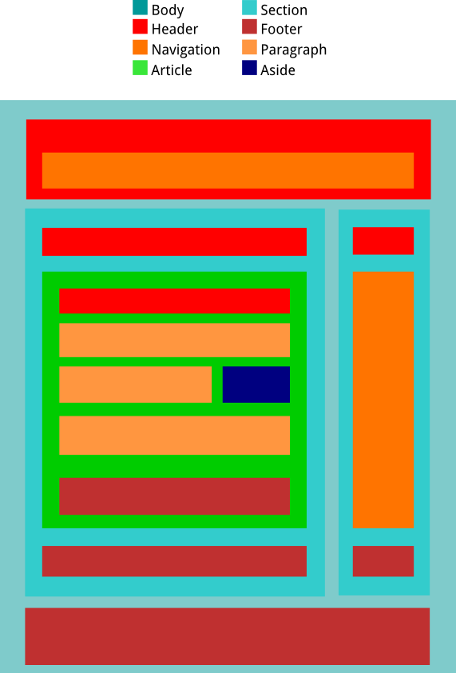

# HTML

## Índice

- [Que es HTML](#Que es HTML)  
	- [Estructura básica de HTML](#Estructura básica de HTML)  
- [Que es HTML5](#Que es HTML5)  
	- [Estructura básica de HTML5](#Estructura básica de HTML5)  
- [Etiqueta HEAD](#Etiqueta HEAD)  
- [Etiqueta BODY ](#Etiqueta BODY)  
	- [Etiquetas del interior de BODY](#Etiquetas del interior de BODY)  
		- [Etiquetas de texto y sus atributos](#Etiquetas de texto y sus atributos)  
		- [Las listas y sus atributos](#Las listas y sus atributos)  
		- [Las tablas y sus atributos](#Las tablas y sus atributos)  
		- [Los archivos multimedia y sus atributos](#Los archivos multimedia y sus atributos)  
		- [Los formularios y sus atributos](#Los formularios y sus atributos)  
			- [Nuevos elementos de los formularios en HTML5](#Nuevos elementos de los formularios en HTML5)  
		- [La división por secciones en HTML5](#La división por secciones en HTML5)  
	
## Que es HTML

HTML son las siglas en inglés de HyperText Markup Language, que en castellano significa Lenguaje de Marcas de HipertTexto. Se usa para crear el cuerpo de una pagina web y como su propio nombre indica es un lenguaje de marcas, que para codificar un documento incorpora etiquetas de apertura y cierre, o que se cierran en la misma etiqueta de apertura.  

## Estructura básica de HTML

La estructura minima de un HTML es:  

```html
<html>
	<head>
		<title>Nombre que aparece en la pestaña</title>
	</head>
	<body>
		<p>Texto que aparece en la propia página</p>
	</body>
</html>
```

Como se puede ver, la unica diferencia entre una etiqueta de apertura y una de cierre es la **/**. Todo el codigo del HTML irá entre dos etiquetas, <html> y </html>.  
Dentro de esta iran <head> y <body>, dentro de HEAD habrá información necesaria del documento, ya sea el título que aparece en la pestaña del navegador, que codificado de caracteres tiene esa página, cada cuanto tiempo se recarga la página, etc.  
Dentro de BODY irá el contenido de la página web, imágenes, textos, links, formularios, etc. Todo lo necesrio para mostrar información al lector de la página.  
Los comentarios pueden ir en cualquier sitio porque no se ejecutan, estos se hacen de la siguiente forma: ```<!-- -->```.  

-----

## Que es HTML5
HTML5 es la última versión de HTML, esta sigue en desarrollo, en ella se eliminaron etiquetas obsoletas, se modificaron otras y se añadieron nuevas con nuevas funcionalidades.  

## Estructura básica de HTML5

```html
<!DOCTYPE HTML>
<html>
	<head>
		<title>Nombre que aparece en la pestaña</title>
	</head>
	<body>
		<p>Texto que aparece en la propia página</p>
	</body>
</html>
```

Como podemos ver para indicar que es en HTML5 solo se debe añadir al inicio del código ```<!DOCTYPE HTML>```.  

-----

## Etiqueta HEAD

Contiene la información relevante de la página. En head se pueden incluir otras etiquetas como TITLE o META.  

- ```<title>Nombre</title>```: En esta etiqueta se pone el nombre de la página web que aparecerá en la pestaña del navegador.  

- ```<meta attributes="..."/>```: Esta es una etiqueta que se cierra en la misma etiqueta de apertura, contiene atributos en su interior que ayudan a definir el comportamiento de la página.  

	- **Atributos de META**:  
	**http-equiv="refresh" content="5;URL=https://www.google.com"** a los *cinco* segundos de abrir la página en el navegador, esta se refreca y te redirige hacia la dirección indicada. Si no ponemos una URL, recarga la propia página.  
	**charset="utf-8"** especifica la codificación del documento html, ya que sin este atributo no se podría poner caracteres como la Ñ o letras acentuadas. Los valores más comunes para este atributo son *utf-8* e "iso-8859-1".  
	
## Etiqueta BODY  

- ```<body>...</body>```: Es el cuerpo de la página, contiene todo lo necesario para mostrar la información que se quiere mostrar a los visitantes de la web, contiene el resto de las etiquetas. Tiene cinco atributos que modifican el texto y el fondo de la página.  

	- **Atributos de BODY**:  
	**background=./images/photo1.png**: Pone de fondo la imagen de la ruto que pongamos, puede ser una ruta absoluta, relativa o una URL del navegador.  
	**bgcolor="#99AABB"**: Pone un color de fondo, dicho color se pone con la nomenclatura RGB en sistema hexadecimal con una almohadilla al principio y las letras en mayúsculas, también se puede poner el nombre del color en inglés sin la almohadilla, solo que así perdemos mucho rango de elección a la hora de escoger colores.  
	**text="#99AABB"**: Cambia el color al texto.  
	**link="#99AABB"**: Cambia el color a los links de la web.  
	**vlink="#99AABB"**: Cambia el color de los links que ya fueron usados en la página (visited link).  
	
### Etiquetas del interior de BODY

Las etiquetas del interior de BODY se pueden clasificar en etiquetas para **texto**, para **listas**, para **tablas**, para **multimedia** (de estas solo imágenes), para **formularios** y para **dividir la web por secciones**.  
**1. De texto**: Crean titulares, links, distintos tipos de fuentes, tamaños y colores, ayudan a dividir el texto por parrafos...  
**2. De listas**: Para crear listas de elementos de forma ordenada o desordenada, indicandando que caracteres se utilizarán para crear dicha lista.  
**3. De tablas**: Para crear tablas de ciertos tamaños, colores, líneas divisorias, etc.  
**4. De multimedia**: Para incluir archivos de audio, video y fotografía.  
**5. Para formularios**: Para recoger información de los usuarios.  
**6. De división por secciones**: Hay determinadas etiquetas que no muestran ningún contenido, si no que ayudan al desarrollador web como dividir la página para que sea más fácil de editarla y crear cambios en ella, estas etiquetas pueden ser los DIV, HEADER, NAV, SECTION, ASIDE, ARTICLE, FOOTER, FIGURE o FIGCAPTION.  

#### Etiquetas de texto y sus atributos

- **Titulares**: Para se usa la etiqueta ```<hN>...</hN>```, donde se sustituye la N por un número entre el uno y el seis, siendo el H1 el más grande y el H6 el más pequeño. A la hora de hacer titulares se recomienda usar una única vez el H1 por temas de SEO.

	- **Atributos de los titulares**:  
	**align="A"**: Sustituyendo la A por **right**, **left** o **center**, según donde queramos que esté alineado el títular.  
	
- **Párrafos**: Para crear los párrafos se usa la etiqueta ```<p>...<p>```, el texto va entre estas dos etiquetas, cuando se cierra la etiqueta, el texto da un salto de línea para saltar a un nuevo párrafo.  

	- **Atributos de los párrafos**:  
	**align="A"**: Tiene la misma función que con los titulares, se puede sustituir la A por **right**, **left**, **center** y también por **justify**, esta nueva forma para alinear el texto es el "justificado" que procura no dejar espacios en blanco al principio ni al final de las líneas.  
	
- **Saltos de línea**: La etiqueta <br/> da un salto de línea de la misma forma que si pulsaramos la tecla ENTER, se puede usar en el interior de los párrafos para crear saltos de línea sin dividir el bloque P.  

- **Barra horizontal**: Crea una barra horizontal que se puede utilizar para separar párrafos y hacer la página más estética.

	- **Atributos de la barra horizontal**:  
	**color="C"**: Le da un color sustituyendo la C por un color en inglés o por su nombre en sistema hexadecimal usando la almohadilla.  
	**align="A"**: Alinea la barra sustitutyendo por **right**, **left** o **center**.  
	**noshade**: Este atributo al ponerlo hace que la barra se vea lisa, eliminando el efecto tridimensional que se crea por defecto.
	**width="W"**: Modifica la anchura de la barra, poniendo un número de pixeles fijo para todas las pantallas o un porcentaje para que se acomode a cada pantalla.  
	**size="S"**: Cambia la altura de la barra, de la misma forma que con la anchura, se puede poner un número fijo de pixeles o un porcentaje, aunque en las alturas es recomendable **no usar** porcentajes.  
	
- **Dar formato al texto**: Dar formato al texto significa cambiar la fuente, el tamaño de las letras o el color, y para ello se utiliza la etiqueta ```<font>...</font>```. Esta etiqueta se puede usar para modificar cualquier tipo de texto, desde titulares, a párrafos enteros o fragmentos de estos.  

	- **Atributos de FONT**:  
	**face="F"**: Cambia la fuente del texto por la fuente que le indiquemos (Comic Sans MS, Arial, Courier...).  
	**color="C"**: Cambia el color de texto que esté marcando, se puede poner en inglés o hexadecimal con con la almohadilla delante.  
	**size="S"**: Cambia el tamaño de la letra por el que le asignemos, también se puede aumentar o reducir en un número determinado de puntos que le asignemos para que el tamaño cambie dinámicamente en función del tamaño de fuente predeterminado que tenga la persona que habra la página. Esto se puede hacer poniendo +2 o -2, o el número de puntos que queramos aumentar o disminuir la fuente.  
	
- **Negrita, cursiva y subrayada**: Para aplicar alguno de estos formatos basta con poner, ```<b>bold</b>``` para negrita, ```<i>italic</i>``` para cursiva,```<u>underlined</u>``` para subrayado, **strong** hace lo mismo que **b** y **em** lo mismo que **i**, solo que tienen un signigicado distinto para el documento. Estas etiquetas se pueden usar a la vez pero se recomienda hacerlo de forma ordenada.  

- **Links o enlaces**: Los links o enlaces son un elemento de la página que hace que podamos navegar entre varias webs o a través de la propia página con solo hacer clic en determinados links. Un link se crea con la etiqueta ```<a>...</a>``` y el texto que va entre las etiquetas será el enlace.  

	- **Atributos de los links**:  
	**href="H"**: Sustituyendo la H por una URL de Internet o una dirección de una carpeta si la página está en el localhost, indicará el destino de ese link.  
	**name="N"**: Se utiliza para hacer un ancla, se le asigna un nombre a la línea, palabra o texto que sea, para poder ir directamente al lugar del documento en el que esté situada esta ancla desde el link correspondiente. Para hacer que un enlace te lleve a un sitio estpecífico hay que poner una almohadilla antes del nombre del ancla. Por ejemplo: En una misma página (```<a href="#indice">Vuelta al índice</a>```), y un link que te lleva a un ancla sería (```<a href="https://miweb.com/index#indice">Vuelta al índice<a/>```).  
	**target="_T"**: Indica de que forma se abrirá el link, sustituyendo la T (la **_** es obligatoria ponerla) por **blank** se abrirá en una pestaña nueva y poniendo **self** se abrirá en la misma pestaña que en la que abrimos el enlace.  
	
#### Las listas y sus atributos
Existen tres tipos de listas, ordenadas, desordenadas y de definición, las primeras siguen un orden llevado por números decimales, números romanos en minúculas o mayúsculas, leras en minúscula o mayúscula... Mientras que las listas desordenadas no llevan ningún tipo de caracter que te indique que posición de la lista estamos, se marca con un punto, un cuadrado, etc. Las listas de definición se usan para definir palabras.  

- **Listas ordenadas**: Estas siguen un orden, y para indicar que queremos este tipo de lista lo haremos con la etiqueta ```<ol></ol>``` de *ordered list*.  

	- **Atributos de las listas ordenadas**:  
	**type="T"**: Indica con que tipo de caracter queremos que marcar el orden. *A* con letras mayúsculas, *a* con letras minúsculas, *1* con número decimales, *I* con números romanos en mayúsculas e *i* con número romanos en minúculas.  
	**start="S"**: Indica con número en de la lista quieres empezar.  
	**reversed**: Con este atributo indicamos que es una lista en orden inverso.  
	
	- Para crear un elemento de la lista se usa la etiqueta ```<li>...</li>```.  
	
- **Listas desordenadas**: No están enumeradas, en su lugar llevan un signo que identifica a cada elemento de la lista. Se hacen con la etiqueta ```<ul>...</ul>``` de *unordered list*.  

	- **Atributos de las listas desordenadas**:  
	**type="T"**: Indica con que forma se designará cada elemento de la lista. Sus valores pueden ser **circle**, **square** o **disc**.  
	
	- Para crear un elemento de la lista se usa la etiqueta ```<li>...</li>```.  
	
- **Listas de definición**: Se usan para definir términos, palabras, expresiones, etc. Para indicar que vas a hacer una lista de definición se usa la etiqueta ```<dl>...</dl>```.  

	- **Término a definir**: Para indicar la palabra que vamos a definir se usa la etiqueta ```<dt>...</dt>```.
	- **La definición**: La definición se hace con la etiqueta ```<dd>...</dd>```, que se indenta automáticamente.  
	
#### Las tablas y sus atributos

Las tablas están constituidas por filas y columnas, en las que si no indicamos ninguna medida es el propio navegador el que se encarga de ajustar las celdas en función del contenido de estas, una tabla también puede llevar incluido un título pero es opcional.  

- **La tabla**: Para indicar que lo que vas a escribir pertenece a una tabla se usa la etiqueta ```<table>...</table>```.  

	- **Atributos de TABLE**:  
	**border="B"**: Se debe poner un número para definir el ancho del borde de la tabla, ya que por defecto el borde vale 0 y no se muestra.  
	**cellspacing="C"**: Se debe poner un número que definirá la distancia entre dos casillas de la tabla.  
	**cellpadding="C"**: Se debe poner otro número, solo que en este caso indica la distacia que hay desde el borde de la casilla hasta el contenido de la misma.  
	**width="W"**: Poniendo un número o porcentaje se designa el ancho de la tabla.  
	**heigth="H"**: Poniendo un número o porcentaje se designa la altura de la tabla, aunque en las alturas es recomendable no utilizar los porcentajes.  
	**bgcolor="B"**: Se pone un color en inglés o en hexadecimal para poner color a toda la tabla.  
	**align="A"**: Alinea la tabla a la izquierda, al centro o a la derecha, según le pongamos **left**, **center** o **right**.  
	
- **El título**: Para poner un título a la tabla se utiliza la etiqueta ```<caption>...</caption>```, poniendo entre las dos etiquetas el título que le queramos poner a la tabla.  

	- **Atributos de CAPTION**:  
	**align="A"**: CAPTION se puede alinear en la parte superior o inferior de la tabla, poneiendo **top** para la parte superior o **bottom** para la parte inferior.  
	
- **Las filas o tuplas**: Para definir una fila se utiliza la etiqueta ```<tr>...</tr>```, en la que en su interior se alojarán las etiquetas que definirán la cantidad de celdas que habrá.  

	- **Atributos de TR**:  
	**align="A"**: Establece la alineación de los elementos de esa tupla hacia el lado que designemos con **left**, **right** o **center**.  
	**valign="V"**: Establece una alineación vertical de los elementos siendo los posibles valores **top** de arriba, **middle** al centro y **bottom** abajo.  
	**bgcolor="B"**: Asigna un color a la tupla sobrescribiendo al color que se pudiera designar en la etiqueta de TABLE.  
	**height="H"**: Poniendo un número se define la altura de la fila.  
	
- **Las celdas o casillas**: Para establecer una o varias celdas dentro de una fila se utiliza la etiqueta ```<td>...</td>``` o si lo que va dentro es como si fuera un titular y queremos que vaya en negrita usaremos la etiqueta ```<th>...</th>```.  

	- **Atributos de TD y TH**:  
	**align="A"**: Se usa para escoger a que lado se alinerá dicha celda, podemos usar **left**, **center** o **right**.  
	**valign="V"**: Es el alineamiento vertical pudiendo alinearse hacia **top**, **middle** y **bottom**.  
	**bgcolor="B"**: Con este atributo se puede escoger el color de la celda, teniendo preferencia sobre el de la etiqueta TABLE y el de su tupla TR.  
	**width="W"**: Si en las tuplas podíamos escoger el alto de cada fila, en las celdas podemos escoger un ancho para cada una, además de poder poner un porcentaje que será relativo a la tabla.  
	**nowrap**: Hace que el texto de una celda no se pueda dividir en varias líneas, por lo que aparecerá en una única línea.  
	**rowspan="R"**: Solo se puede aplicar a las celdas y significa *expadir fila*, por lo que indicandole un número, esa casilla pasará a ocupar el número de celdas que se le indiquen siempre hacia abajo.  
	**colspan="C": Si el otro se expandía a través de las filas, este se expande a través de las columnas siempre hacia la derecha.  
	
También se pueden agrupar las distintas filas de una tabla con las etiquetas ```<thead>...</thead>``` para la cabecera de la tabla, ```<tbody>...</tbody>``` para lo que es el cuerpo de la tabla y ```<tfoot>...</tfoot>``` para el pie de la tabla. A estas tres posibles agrupaciones se le pueden aplicar todas las modificaciones de los *align*, los *valign*, los *bgcolor* y el *height*, es decir, todos los atributos pertenecientes a las tuplas de la etiqueta TR.  

#### Los archivos multimedia y sus atributos

- **Las imágenes**: Entre todos los recursos multimedia, las imágenes son las más usadas y se ponen con la etiqueta ``````.  

	- **Los atibutos de IMG**:  
	**src="S"**: Este atributo es OBLIGATORIO, ya que con el definimos de donde sale la imágen que empleamos, puede ser una dirección absoluta o relativa del ordenador o una dirección de Internet.  
	**alt="A"**: Con el podemos definir un texto que acompañará a la imágen que estamos definiendo con *src*.  
	**width="W"**: Podemos asignarle un ancho fijo poniendo los pixeles o con un porcentaje.  
	**height="H"**: Y con este atributo se designa una altura, aunque es recomendable no utilizar los porcentajes.  
	**usemap="#U"**: Este atributo se utiliza para usar el mapeado que se define con la etiqueta MAP, la almohadilla es obligatoria ponerla, y si el mapeado pertenece al de otra página se pondrá la ruta del mapa con la almohadilla y el nombre al final.  
	
- **El mapeado de imágenes**: Se utiliza para crear links sobre las imágenes o parte de estas con la etiqueta ```<map>...</map>```.  

	- **Atributos de MAP**:  
	**name="N"**: Designa un nombre al mapeado que se usará en el atributo *usemap* de las imágenes.  
	
- **El área del mapaeado**: Para designar una zona o zonas que tendrán enlaces a lo que nosotros queramos se usa la etiqueta ```<area>...</area>``` dentro de MAP.  

	- **Atributos de AREA**:  
	**shape="S"**: Define la figura del mapeado **rect** para rectágulos o cuadrados, **poly** para otros polígonos (triángulos, rombos, pentagonos,etc) o **circle** para círculos entre otros.  
	**coords="C"**: En este atributo se difinen las coordenadas X e Y de cada punto. Para *rect* se marca una esquina y su opuesta (por ejemplo, la superior derecha y la inferior izquierda), para *poly* se marcan todas las esquinas del polígono yendo por orden, y para *circle* se marca el centro y el radio del círculo.  
	**href="H"**: Establece la dirección del enlace a la que llevará esa sección del mapeado.  
	
#### Los formularios y sus atributos

Son las casillas, botones, cajas de texto... Todo aquello que se utiliza para recoger información del usuario y posteriormente enviarlo al servidor.  

- **El formulario**: Todos los elementos de recogida de información del usuario que queremos que vayan en el mismo paquete de datos recogidos, los pondremos en el interior de la etiqueta ```<form>...</form>```.  

	- **Atributos de FORM**:  
		- **action="A"**: Sustituyendo la A por una URL, será la dirección de destino a la que el formulario mandará los datos recogidos del usuario.  
		- **method="M"**: Existen dos posibles métodos, **post** o **get**, el método *post* manda los datos de una forma invisible para el usuario, mientras que el método *get* manda los datos en la URL por lo que serán visibles para el usuario.  
		- **enctype="E"**: Indica que tipo de codificación para el formulario se usrará, si es **text/plain** solo recogeremos texto plano, es deir, DNI, contraseñas, nombres de usuario, números de telefono, etc. Si es **multipart/form-data** permitirá adjuntar archivos al formulario.  
		- **name="N"**: Pone un nombre al formulario, porque puedenexistir más de un formulario en una página.  
		- **autocomplete="A"**: **SOLO EN HTML5**, puede tomar los valores de de **on** y **off** para autocompletar con los valores que el usuario introdujo anteriormente.  
		- **novalidate**: **SOLO EN HTML5**, no valida los formularios por lo que si hay errores los manda al servidor igualmente.  
	
- **Atributos de los controles**: **Son comunes a todos los objetos de un formulario** y se usan para gestionarlos desde el lado del desrrollador, como para facilitar la uilización de los mismos al usuario.  

	- **name="N"**: Pone un nombre identificador al objeto recolector de datos, este atributo es OBLIGATORIO ya que sin él, el navegador ignoraría el INPUT en cuestión.  
	- **value="V"**: Establece un valor inicial de control, el único INPUT que no tiene este atributo es el *textarea*.  
	- **disabled**: Desactiva el INPUT en el que esté. No se podrá acceder a él de ninguna forma.  
	- **readonly**: Hace que el INPUT sea únicameten de lectura, no se podrá modificar aunque sí podrá ser seleccionado.  
	- **tabindex="T"**: Permite controlar el foco de los INPUT con el tabulador, se le asigna un número que representará el orden en el que irán los INPUT según le vayamos dando al tabulador.  
	- **acceskey="K"**: Establece una tecla de acceso rápido a los INPUT. Si por ejemplo el atajo a la contraseña es la letra **p**, sería ```acceskey="p"``` y accederíamos a ese campo con la combinación de teclas ```Alt + P```.  
	- **autocomplete="A"**: **SOLO EN HTML5**, con las palabras **on** y **off** nos permite escoger si el control tiene autocompletado o no según si el usuario relleno ese campo anteriormente.  
	- **autofocus**: **SOLO EN HTML5**, cuando se carga la página hace que el control que tenga este atributo tenga el foco para mejorar la accesibilidad de la página.  
	- **form="F"**: **SOLO EN HTML5**, permite asociar a un formulario el control que está fuera del mismo, para realizar esto el atributo **form** debe ser igual al **id** del formulario al que deseamos relacionar.  
	- **formaction="F"**: **SOLO EN HTML5**, sirve para que la información recogida en dicho control se mande a otra dirección, por lo que **formaction** debe ser igual a otra url.  
	- **formenctype="F"**: **SOLO EN HTML5**, sirve para cambiar el valor del atributo *enctype* de la etiqueta FORM, sus valores pueden ser **multipart/form-data** o **text/plain** y solo se puede usar en controles de tipo *submit*.  
	- **formmethod="F"**: **SOLO EN HTML5**, se utiliza para cambiar el método del formulario, puede tomar los valores de **get** y **post**, y solo se puede usar en los controles de tipo submit.  
	- **formnovalidate**: **SOLO EN HTML5**, tiene la función de no validar el formulario, solo se puede utilizar en controles de tipo submit.  
	- **multiple**: **SOLO EN HTML5**, da la posiblidad de añadir más de un elemento en los controles de tipo email o file.  
	- **pattern="P"**: **SOLO EN HTML5**, permite crear un patrón usando RegEx (regular expresion), pusiendo ser usado en controles de tipo *text*, *password*, *email*, *tel*, *url* o *search*.  
	- **required**: **SOLO EN HTML5**, poniendolo en un control obligará al usuario a rellenar ese campo para poder mandar el formulario.  
	
- **Los botones**: Se pueden crear botones de dos formas distintas con dos etiquetas distintas, ```<input />``` y con ```<button>...</button>```.  

	- **Botones con la etiqueta INPUT**: La etiqueta INPUT sirve para hacer muchos tipos de formularios, y entre esos están los botones.  
	**type="submit"** o **type="reset"**: Para los botone puede ser o **submbit** o **reset**, el primero manda los datos recogidos a la página indicada en el formulario, y el segundo borra todo lo escrito en el formulario.  
	**value="V"**: Asigna un texto que se pondrá en el botón.  
	
	- **Botones con la etiqueta BUTTON**: Se usa de una forma parcida a la anterior, pero nos permite añadir imágenes al botón.  
	**type="T"**: De la misma forma que arriba, puede ser de tipo **submit** o **reset**. Para instertar una imágen al botón se haría ```<button type="submit">  Enviar formulario </button>```.  
	
- **Las cajas de texto**: Permiten escibir en su interior, se usa la etiqueta INPUT.  

	- **type="text"**: Para que sea una caja de texto, type será igual a **text**.  
	- **name="N"**: Poniendo un nombre permite identificar en que caja de texto se escribió cada cosa en el servidor.  
	- **value="V"**: Establece un valor por defecto que se mandará cuando se envie el formulario.  
	- **size="S"**: Establece un largo a la caja en la que se pondrá el texto.  
	- **maxlength="M"**: Establece un número máximo de caracteres para la caja.  
	- **placeholder="P"**: Introduce un texto indicativo de para que sirve esa caja del formulario.  
	- **list="L"**: **SOLO EN HTML5**, permite que aparezca una lista con opciones predefinidas en un *datalist* (será explicado al final de los INPUT), el **list** será igual al *id* del *datalist*.  
	- También se pueden usar *readonly*, *disabled*, *tabindex* y *acceskey*.  
	
```html
<input type="text" name="nombreUsuario" size="20" maxlength="25" placeholder="Introduzca su nombre de usuario"/>
<!-- Muestra un recuadro para text donde el tamaño será de 20 y el máximo de caracteres será de 25 -->
```
	
- **Las cajas de contraseñas**: Nos permiten escribir en su interior sin que se pueda ver que caracteres estamos escribiendo, se usa la etiqueta INPUT.  

	- **type="password"**: Para que sea una caja de contraseña, type será igual a **password**.  
	- **name="N"**: Establece un nombre a ese campo de contraseña para su identificación en el backend.  
	- **maxlength="M"**: Establece un número máximo de caracteres para la contraseña.  
	- **placeholder="P"**: Introduce un texto indicativo de para que sirve esa caja del formulario.  
	
```html
<input type="password" name="contrasenaUsuario" placeholder="Introduzca su contraseña"/>
<!-- Muestra un recuadro para contraseñas donde no hay un máximo de carateres -->
```
	
- **Las áreas de texto**: Permiten introducir en su interior varias líneas, estas áreas de texto se crean con la etiqueta ```<textarea>...</textarea>```. Si entre las etiquetas de textarea escribimos un texto este aparecerá escrito en el interior y podrá ser borrado, modificados, etc.  
	
	- **name="N"**: Asigna un nonmbre que identifica al área de texto.  
	- **cols="C"**: Poniendo un número indicamos el número de colúmnas que habrá por cada línea, estas colúmnas son el número de caracteres que entran por línea.  
	- **rows="R"**: Poniendo un número se establece un número de filas visibles.  
	- **placeholder="P"**: Introduce un texto indicativo de para que sirve esa área del formulario.  
	
```html
<textarea name="camentario" cols="50" rows="7" placeholder="Introduzca su comentario"></textarea>
<!-- Muestra un textarea con una capacidad de 50 letras por línea y se muestran las líneas de 7 en 7 y un placeholder qu ayude al usuario -->
```
	
- **Los checkbox**: Son casillas de marcado y desmarcado, que permiten al usuario marcar varias opciones ya definidas por el desarrollador web, se usa la etiqueta INPUT.  
	
	- **type="checkbox"**: Para que el input tenga una casilla de verificación el atributo *type* será igual a **checkbox**.  
	- **name="N"**: Establece el nombre que será enviado al servidor una vez el usuario mande el formulario, *name* es el identificador del grupo de las casillas de verificación.  
	- **value="V"**: Establece el valor que será enviado al servidor junto con el valor de *name*, este valor distingue el checkbox de mismo nombre (**name=value**, **colores=rojo&colores=azul**).
	- **checked="checked"**: Se utiliza para que la casilla aparezca ya marcada de forma predeterminada.  
	Si no ponemos *value* y marcamos la casilla esta se mandará como *name=on*.  
	
```html
<input type="checkbox" name="coloreDeLaCamiseta" value="azul"/>Azul
<br/>
<input type="checkbox" name="coloreDeLaCamiseta" value="rojo"/>Rojo
<br/>
<input type="checkbox" name="coloreDeLaCamiseta" value="amarillo"/>Amarillo
<!-- Muestra tres checkbox en las que se pueden marcar las tres casillas -->
```
	
- **Los botones de radio**: Son similares a las casillas de verificación, se diferencian en que los radiobuttons con el mismo nombre solo se podrá marcar una casilla, se usa la etiquta INPUT.  

	- **type="radio"**: Poniendo **radio** en el atributo *type* se crea un radiobutton.  
	- **name="N"**: Establece un nombre que agrupará los radiobuttons en un único grupo en el que solo se podrá marcar uno.  
	- **value="V"**: Asigna el valor que será enviado al servidor.  
	- **checked="checked"**: Marca de forma predeterminada el radiobutton esa casilla de ese grupo con el mismo *name*.  
	
```html
<input type="radio" name="AceptaCondiciones" value="si"/>Si
<br/>
<input type="radio" name="AceptaCondiciones" value="no" checked="checked"/>No
<!-- Muestra dos radiobuttons en los que solo se puede marcar uno -->
```

- **Las listas desplegables**: Son listas que se despliegan como los que contienen el huso horario, el nombre de las localidades, etc. Se crean con la etiqueta ```<select>...</select>```.  

	- **name="N"**: Asigna un nombre a la lista desplegable o menú.  
	- **size="S"**: Poniendo un número, el desplegable mostrará tantas opciones como designemos en este atributo.  
	- **multiple="multiple"**: Permite marcar varias opciones si mantenemos pulsado la tecla **Ctrl**
	
		- Para añadir opciones se usa la etiqueta ```<option>...</option>``` dentro de SELECT.  
		
			- **value="V"**: Pone el valor que será mandado al servidor en caso de que se mande esa opción (si no hay *value* se mandará el texto de la opción).  
			- **selected="selected": Para marcar una opción de forma predeterminada.  
			- **disabled="disabled": Desactiva la opción y se suele usar para indicar lo que hay que hacer, tiene la misma función que el *placeholder*.
	
		- Para agrupar las opciones por grupos se usa la etiqueta ```<optgroup>...</optgroup>```.  
		
			- **label="L"**: Establece un nombre para el grupo de opciones.  

```html
<select name="curso" size="5">
	<option selected="selected" disabled="disabled">Seleccione el curso de matriculación</option>
	<optgroup label="Educación Secundaria">
		<option value="1ESO">1º de ESO</option>
		<option value="2ESO">2º de ESO</option>
		<option value="3ESO">3º de ESO</option>
		<option value="4ESO">4º de ESO</option>
	</optgroup>
	<optgroup label="Bachillerato">
		<option value="1Bach">1º de Bachillerato</option>
		<option value="2Bach">2º de Bachillerato</option>
	</optgroup>
</select>
```

- **El fieldset**: Se utiliza para agrupar los controles de los formularios para que aparezcan en el interior de una caja, para crearlo se utiliza la etiqueta ```<fieldset>...</fieldset>```.  

	- Para añadir un título a este marco de los controles se usa la etiqueta ```<legend>...</legend>``` pondiendo el título entre las etiquetas.  
	
```html
<fieldset>
	<legend>Formulario</legend>
	<input type="text" name="usuario"/>
	<input type="password" name="contrasenaUsuario"/>
</fieldset>
```

- **El label**: Permite asociar un texto al control para crear formularios más fáciles de usar y así mejorar la accesibilidad, hay dos tipos de etiquetas la *implicita* y la *explicita*, y se crean con la etiqueta ```<label>...</label>```.  

	- La etiqueta implicita se crea con el control y el texto en el interior de la etiqueta.  
	- La etiqueta explicita se hace con el control con *id* fuera de la etiqueta y relacionandolo con la etiqueta correspondiente con el texto. Esta forma de etiquetar un control se utiliza cuando entre el control y el texto existe otro elemento que nos impide hacer la forma implicita, como por ejemplo una tabla
	
```html
<!-- Label implicito -->
<label><input type="checkbox" name="AceptaTerminos" value="si"/>Sí</label><br/>

<!-- Label explicito -->
<input type="checkbox" name="AceptaTerminos" value="si" id="siAcepta"/>
<label for="siAcepta">Sí</label>  <!-- El for debe ser el mismo que el id -->
```

##### Formularios de HTML5
En la versión de HTML5 se añadieron nuevos tipos de formularios para la etiqueta INPUT.  

- **La selección de colores**: Permite escoger un color, se utiliza en la etiqueta INPUT.  

	- **type="color"**: Para tener un control de este tipo basta con poner **color** en type.  
	- **name="N"**: Asigna un nombre para identificar el control.  
	
- **La fecha**: Nos permite elegir una fecha, que tendrá el formato dd/mm/aaaa.  

	- **type="date"**: Poniendo **date** podremos hacer que este control nos permita escoger una fecha.  
	- **name="N"**: Establece un nombre para que el servidor identifique este control.  
	
- **La hora**: Permite elegir una hora con el formato hh:mm.  

	- **type="time"**: Para que se pueda escoger la hora se debe poner **time** en este atributo.  
	- **name="N"**: El nombre obviamente es obligatorio para su identificación en el servidor.  
	
- **La fecha y hora indicando la zona**: Permite indicar día y hora, e indicando la zona. **Este no es soportado en todos los navegadores**.  

	- **type="datetime"**: Poniendo **datetime** podemos escoger día y hora.  
	
- **La fecha y hora sin indicador de zona**: Hace lo mismo que el de arriba pero sin indicar la zona y además es soportado en muchos más navegadores.  

	- **type="datetime-local**: Con **datetime-local** podemos escoger día y hora sin que importe la zona.  
	- **name="N"**: Identifica el control en el servidor.  
	
- **La semana**: En vez de elegir una día o una hora en concreto este nos permite seleccionar una semana.  

	- **type="week"**: Poniendo **week** podremos seleccionar la semana entre la número 1 y la 53.  
	- **name="N"**: Sigue teniendo la función de identificar el control en el servidor.  
	
- **El mes**: Nos permite escoger un mes.  

	- **type="month"**: Poniendo **month** podemos escoger un mes y además especificando el año.  
	- **name"N"**: Especifica un identificador dentro del servidor.  
	
- **El EMail**: Hace que el control se asegure de tener un email, solo mira si hay un **@** o no.  

	- **type="email"**: Poniendo **email** podemos hacer que el control verifique si contiene un email o no, aunque sea de una manera muy simple.  
	- **name="N"**: Pone el nombre identificador a ese control.  
	
- **Un número**: Nos permite elegir un número.  

	- **type="number"**: Haciendo que el tipo sea **number** hacemos que podamos escoger números.  
	- **name"N"**: Especifica un identificador dentro del servidor.  
	- **min="M"**: Poniendo un número se establece un valor mínimo.  
	- **max="M"**: Poniendo un número se establece un valor máximo.  
	- **step="S"**: Con este atributo podemos hacer que los valores válidos vayan de tanto en tanto.  
	- **value="V"**: Establece un valor por defecto.  
	
- **El rango**: De igual forma que con el de *number* este también nos permite elegir un número entre un determinado rango.  

	- **type="range"**: Poniendo **range** el control será una regleta que nos permitirá escoger el valor deseado.  
	- **name="N"**: El nombre identifica al control en el servidor.  
	- **min="M"**: Poniendo un número se establece un valor mínimo.  
	- **max="M"**: Poniendo un número se establece un valor máximo.  
	- **step="S"**: Con este atributo podemos hacer que los valores válidos vayan de tanto en tanto.  

- **El campo de búsqueda**: Es muy similar al campo de texto pero se utiliza para realizar busquedas, la principal diferencia es estilística.  

	- **type="search"**: Poniendo **search** hacemos que el control sea de búsqueda.  
	- **name="N"**: Hace de identificador en el servidor.  
	
- **El teléfono**: Es el campo dedicado a introducir un número de teléfono, en los teléfonos móviles en este campo el teclado se sustituye por uno numérico.  

	- **type="tel"**: Poniendo **tel** lograremos que en el campo se pueda introducir un número de teléfono.  
	- **name="N"**: El name identificará el número de teléfono dentro del servidor.  
	
- **La URL**: Nos permite mandar al servidor una URL.  

	- **type="url"**: Para que el control sea de URL debemos poner que sea de tipo **url**.  
	- **name="N"**: Y name continúa siendo para identificar el control en servidor.  

##### Nuevos elementos de los formularios en HTML5

- **Los datalist**: Permiten crear una lista desplegable con opciones predefinidas en las cajas de texto para ayudar al usuario a completar la información.  

	- **id="I"**: Identifica al **datalist** ya que puede haber otros en la página.  
	
		- Para añadir las opciones se utiliza la etiqueta ```<option />```.  
			
			- **value="V"**: La etiqueta OPTION tiene el atributo **value** en el que se ponen las opciones que sugerirá el control.  
			
```html
<input type="text" name="comidaConA" list="comidaConA"/>

<datalist id="comidaConA">
	<option value="Albondigas"/>
	<option value="Arroz"/>
	<option value="Aguacate"/>
	<option value="Alitas de pollo"/>
</datalist>
<!-- Un input para comida con la letra A -->
```

#### La división por secciones en HTML5

Permiten dividir por secciones el código de la página html para hacerlo más fácil de editar y construir. Esta división se divide entre las etiquetas:  

- ```<header>...</header>``` para crear una cabecera al inicio de la página.  
- ```<nav>...</nav>``` para tener una selección de links a modo de menú debajo de la cabecera.  
- ```<section>...</section>``` para dividir la página por secciones para ayudar a ordenar la página como por columnas o noticias.  
- ```<aside>...</aside>``` con la función de tener una barra lateral con la utilidad de almacenar con tener un menú de acceso rápido, publicidad o información relevante para el usuarion.  
- ```<footer>...</footer>``` para tener un pie de página y dedicar el ese espacio a alguna cita, algún link o información adicional.  
- ```<article>...</article>``` normalmente utilizado para ayudar a dividir noticias en distintos articulos, cada uno con su titulo y su información.  
- ```<figure>...</figure>``` para dividir una sección que contiene imágenes o vídeos.  
- ```<figcaption>...</figcaption>``` para añadir un pequeño texto descriptivo a los recursos que son contenidos por **figure**.  

Aquí dejo un ejemplo:  



